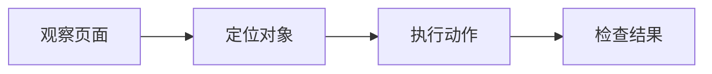
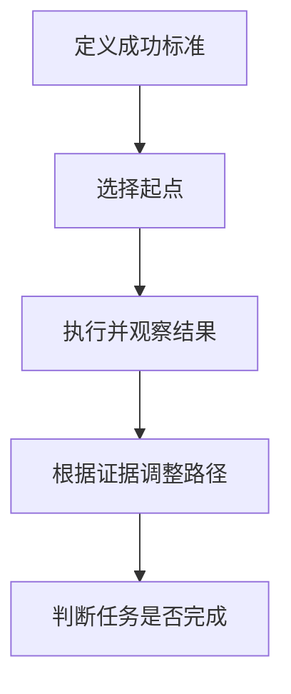
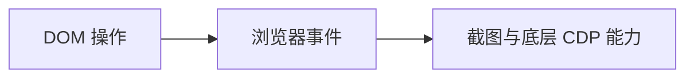

# Web Access skill

这里分析 Web Access 如何把浏览器自动化组织成一套完整的 Agent Harness。重点不在某个点击接口，而在于如何把联网策略、浏览器控制、运行状态和站点经验组合成稳定的执行环境。

Web Access 没有替代模型推理，而是降低了浏览器环境的复杂度，让 Agent 可以围绕目标持续观察、执行和校验。

## 问题背景

传统浏览器 Agent 通常面对截图、坐标和动态页面。页面滚动、弹窗、异步加载、iframe、登录状态和元素位移都会增加操作的不确定性。

对模型而言，这不是单纯的“能不能点击”问题，而是一个高噪声的运行环境：

- 页面结构没有被明确暴露
- 操作目标容易随布局变化而漂移
- 页面状态难以被稳定读取
- 登录、会话和动态渲染难以在任务之间保持
- 操作是否成功经常缺少明确反馈

Web Access 的核心工作，是把这些环境问题吸收到统一的执行层中。

## 核心机制

Web Access 在 Agent 与浏览器之间增加了一个 `cdp-proxy.mjs`，通过 HTTP API 封装 Chrome DevTools Protocol。

```text
/new
/info
/eval
/click
/clickAt
/setFiles
/scroll
/screenshot
/close
```

这些接口分别负责创建标签页、读取状态、执行 JavaScript、点击、上传、滚动、截图和关闭标签页。每次调用返回结构化结果，使浏览器操作从视觉控制问题转化为程序调用问题。

对 Pi 这类代码型 Agent，动作空间因此被明显压缩：



模型不再需要直接处理大量鼠标轨迹和坐标变化，而是通过少量稳定接口完成任务。

### Policy

Web Access 的 `SKILL.md` 没有把浏览过程写成固定操作手册，而是定义了目标驱动的执行闭环原则。



搜索没有结果，并不意味着只能继续更换关键词。它也可能说明：

- 搜索入口不适合当前目标
- 内容没有被公开索引
- 页面需要登录状态
- 应直接访问一手来源
- 目标 URL 缺少必要参数
- 目标本身不存在

每一步结果都被视为证据。页面缺少预期元素、接口返回错误、重试没有改善，都应触发路径调整，而不是机械重复同一操作。

这种设计保留了 Agent 的判断能力。Skill 负责提供稳定原则和技术事实，不替模型预先写死所有步骤。

### Capability

#### DOM 优先视觉

Web Access 的主要观察方式不是截图，而是通过 `/eval` 读取 DOM。

```javascript
document.querySelector(...)
document.body.innerText
document.querySelectorAll(...)
```

DOM 可以直接提供页面的结构和语义：

- 按钮、链接和输入框的类型
- 元素之间的层级关系
- 页面是否加载完成
- 隐藏区域和折叠区域中的内容
- 图片、视频和下载资源的真实地址
- 当前页面的 URL 与状态

截图主要用于图片、视频和无法通过 DOM 判断的视觉信息。

这种方式比“截图—识别—坐标点击”更稳定。Agent 不需要猜测某个蓝色区域是否是按钮，而是可以确认页面中是否存在特定元素，并在操作后检查状态是否发生预期变化。

DOM 也并不等于简单的 CSS 选择器。Shadow DOM、iframe 和懒加载会形成额外边界，因此 Web Access 允许通过 JavaScript 递归检查页面结构，并在必要时通过滚动和截图补充观察。

#### 分层执行

Web Access 提供了不同强度的操作方式。

| 层级       | 方式                                        | 适用场景                         |
| ---------- | ------------------------------------------- | -------------------------------- |
| DOM 操作   | `/eval`、`/click`                           | 普通按钮、表单和页面状态修改     |
| 浏览器事件 | `/clickAt`                                  | 需要真实用户手势的组件和上传入口 |
| CDP 能力   | `/setFiles`、`/screenshot`、`Page.navigate` | 文件上传、视觉读取和底层页面控制 |

最轻量的方式是直接操作 DOM。它速度快、结果明确，适合多数后台系统和表单。

当页面要求真实用户手势时，可以通过 `Input.dispatchMouseEvent` 发送鼠标按下和释放事件。文件上传则可以使用 `DOM.setFileInputFiles` 直接设置本地文件，不依赖操作系统文件选择框。

因此，浏览器操作形成了一个逐级升级的路径：



Agent 可以根据页面反馈选择合适层级，而不是对所有网站使用同一种点击方式。

#### 联网工具路由

浏览器并不是所有联网任务的默认工具。Web Access 对不同获取方式进行了分工。

| 任务                       | 优先方式  |
| -------------------------- | --------- |
| 信息发现                   | WebSearch |
| 已知网页的定向提取         | WebFetch  |
| 原始 HTML、Meta 和 JSON-LD | curl      |
| 长文章和文档预处理         | Jina      |
| 动态页面、登录态和交互操作 | CDP       |

搜索引擎适合发现来源，但不能替代一手来源。已知 URL 的正文提取通常不需要启动浏览器；需要登录、动态渲染或页面交互时，才进入 CDP。

这套规则本质上是一个联网工具路由器。它减少了以下无效操作：

- 静态网页也启动完整浏览器
- 登录页面反复使用 WebFetch
- 已知 URL 仍重新搜索
- 动态页面持续重试 curl
- 将整个页面 DOM 无差别送入模型上下文

模型负责判断当前任务属于哪种场景，Skill 提供可复用的选择原则。

### Runtime

Web Access 连接的是用户正在使用的 Chrome 或 Edge，而不是新建一个独立的无状态浏览器。

因此，Agent 可以继承真实浏览器中的运行状态：

- Cookie 和登录状态
- Local Storage
- 用户配置
- 已登录的内部系统
- 浏览器历史和书签
- 页面中的动态渲染结果
- 当前可播放的视频内容

这减少了重新登录、验证码、二次验证和内网访问等摩擦。

Web Access 默认创建自己的后台标签页，并通过 `targetId` 管理。它不主动操作用户已有标签页，任务完成后关闭自己创建的页面，从而把 Agent 的执行环境与用户当前工作区分开。

它还可以检索本地浏览器的历史和书签，用于寻找公网无法搜索到的内部系统，或定位用户过去访问过但无法准确描述地址的页面。

### Memory

不同网站具有不同的 URL 结构、登录机制、反自动化策略和页面加载方式。Web Access 将这些经过验证的经验记录在 `references/site-patterns/` 中。

Web Access 对这些问题增加了基础管理能力：

- 启动前检查 Node.js 和浏览器状态
- 自动发现 Chrome 和 Edge 的调试端口
- 通过 `/health` 检查 Proxy 状态
- Proxy 后台常驻并复用连接
- 连接成功后锁定浏览器类型
- WebSocket 断开后重新发现浏览器
- 每个标签页使用独立 `targetId`
- 页面导航后等待加载状态
- CDP 命令设置超时
- 自动清理长时间闲置的标签页
- 区分用户标签页和 Agent 标签页

这些机制本身并不智能，但它们决定了模型推理能否稳定作用于真实页面。

## 与 Pi 的配合

Pi 负责规划、推理、调用工具和根据结果调整路径。Web Access 则为浏览器任务提供执行环境和操作原则。

```text
用户目标
   ↓
Pi：规划、推理、观察和纠错
   ↓
SKILL.md：联网策略、成功标准和技术事实
   ↓
CDP Proxy：有限且稳定的浏览器接口
   ↓
Chrome / Edge：登录态和动态运行环境
   ↓
site-patterns：经过验证的站点经验
```

Pi 不需要直接理解 CDP 的全部协议，也不需要在每个任务中编写完整的 Playwright 脚本。它只需要围绕当前目标调用少量接口，并持续读取反馈。

这类 Harness 的作用不是代替模型推理，而是吸收模型不擅长处理的环境复杂度。

可以将这种配合概括为：

```text
推理循环
× 稳定工具接口
× 真实运行状态
× 可更新经验
= 可持续执行的浏览器 Agent
```

## 结论

Web Access 代表了一种 Agent 工程方法：不继续堆叠提示词，也不把所有操作路径写死在工具中，而是在策略、能力、运行环境和经验之间建立稳定边界。其中：Skill 主要解决 Policy，工具协议主要解决 Capability，浏览器自动化框架主要解决 Runtime。

| 层级       | 解决的问题     | Web Access 中的实现                              |
| ---------- | -------------- | ------------------------------------------------ |
| Policy     | 应该如何判断   | `SKILL.md` 中的浏览原则、工具选择和停止条件      |
| Capability | 能够执行什么   | CDP Proxy 暴露的导航、观察、点击、上传和截图接口 |
| Runtime    | 在哪里执行     | 用户真实的 Chrome 或 Edge                        |
| Memory     | 过去学到了什么 | `site-patterns` 中的站点经验                     |

浏览器之所以变得“听话”，并不是模型突然获得了更强的视觉控制能力，而是执行环境被重新组织了：

- 复杂 GUI 被压缩为有限接口
- DOM 成为主要观察通道
- 视觉能力只在必要时补充
- 每一步操作都有结构化反馈
- 登录状态和动态页面由真实浏览器提供
- 站点经验可以跨任务复用
- Skill 保留模型判断，而不是替模型写死步骤

这使浏览器操作从一次性的自动化脚本，转化为 Agent 可以持续观察、执行、验证和改进的运行系统。
