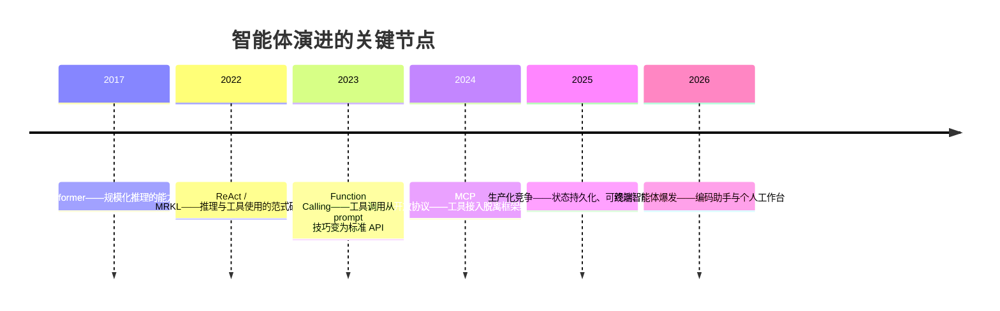

# 智能体的演进

从 2017 年 Transformer 论文到今天，"智能体"走过了一条从研究范式到工程系统、再到消费产品的路。这一篇记录这条演进主线，比较当前的代表产品，最后给出我自己的选型判断。

> 文中产品信息为**写作时点快照**（2026 年中），版本与格局会持续变化，方法论部分更耐用。

## 一、演进主线：四次跃迁



1. **能力底座（2017）**：Transformer 使大规模预训练成为可能，没有强语言建模就没有后续一切。
2. **范式确立（2022）**：ReAct 把"推理—行动—观察"交错生成系统化；MRKL 从系统角度提出模块化工具路由。
3. **接口标准化（2023）**：OpenAI 发布 Function Calling，"选择工具并输出参数"从纯 prompt 约定走向 API 级结构化接口，直接催化了 LangChain/AutoGPT/BabyAGI 一波框架爆发。
4. **协议与运行时治理（2024–2026）**：控制流与状态被显式化——LangGraph 将 agent 表达为图并强调可恢复；Anthropic 提出 MCP，把工具与数据连接从"N×M 集成"抽象为客户端—服务器协议层；微软融合 AutoGen 与 Semantic Kernel 成立 MAF，把 observability、compliance、durability 作为卖点；OpenAI Agents SDK 以 sessions/guardrails/tracing 定位 Swarm 的生产级继任。

一句话概括这九年：**模型越来越像大脑，框架的工作重心却从"让它更聪明"转向了"让它更可靠"**。

## 二、三条产品路线

| 路线 | 代表 | 服务对象 | 核心竞争力 |
| --- | --- | --- | --- |
| 编排框架 | LangChain / LangGraph / CrewAI / AutoGen→MAF / OpenAI Agents SDK | 工程团队 | 可组合抽象、状态管理、评测追踪 |
| 低代码平台 | Dify / Coze Studio / n8n | 搭建者（业务工程师） | 可视化编排、插件生态、部署体验 |
| 终端智能体 | Claude Code / Codex / OpenCode / Pi / WorkBuddy | 个人与团队 | 执行环境、权限模型、技能生态 |

低代码平台与开发框架的分野本质是人群分野：前者强调模板化与集成，后者强调可编程性与可控性。而终端智能体是最近一年变化最快的战场，值得单独展开。

## 三、终端智能体：四个代表

### 1. OpenCode——开放的多模型底座

MIT 开源、provider-agnostic（Claude/OpenAI/Google/本地模型均可接）、TUI 优先、client/server 架构。关键设计是内置 **build 与 plan 双代理**：build 全权限开发，plan 默认只读、运行命令前需许可——这是"最小权限"原则在交互层的产品化。

### 2. Pi——极简 harness 哲学

Mario Zechner 的 pi-mono 刻意保持系统提示词最小化，通过分层加载的 AGENTS.md、skills 与扩展机制把定制权交给使用者；上下文压缩、会话持久化全部可编程。它代表一条相反的路线：**不替你聪明，让你自己组装聪明**（记忆管理详见[智能体的记忆](knowledge/llm/agents/agent-memory)中的 Pi 案例）。

### 3. OpenAI Codex——AGENTS.md 生态的推动者

Codex CLI 把"仓库级指令文件"（AGENTS.md）变成了事实标准：项目约定、构建命令、代码规范写在仓库里，任何兼容的智能体进场即可读取。云版进一步支持并行派发任务。它的意义在于**约定先于产品**——上下文文件的格式统一，比任何一个具体工具都更能降低生态摩擦。

### 4. WorkBuddy——通用工作台路线

腾讯推出的全场景 AI 智能体工作台（2026 年出海）：自然语言派活，自主规划并执行多步任务，直接读写授权的本地文件，交付文档/表格/演示稿等成品而非聊天回复。特色是把"专业能力"拆成了三种可插拔资产——**Experts**（预置方法论的领域专家）、**Skills**（技能包）、**Connectors**（Slack/GitHub/Notion 等外部服务连接器），外加云端定时任务与多 Agent 并行的项目空间。

### 对比速览

| 维度 | OpenCode | Pi | Codex | WorkBuddy |
| --- | --- | --- | --- | --- |
| 开源 | MIT（完全开源） | 开源 | CLI 开源 | 商业产品 |
| 模型绑定 | 无（任意 provider） | 无 | OpenAI 为主 | 多模型自动路由 |
| 主场景 | 编码 | 编码 | 编码 | 全场景办公 |
| 定制方式 | 配置+代理 | AGENTS.md/skills/扩展 | AGENTS.md | Experts/Skills/Connectors |
| 权限模型 | build/plan 分离 | 最小提示词+显式审批 | 沙箱执行 | 目录授权+结果审查 |

## 四、如何选择实现方式

产品会过时，选择的方法论不会。确定方案前先问：这个系统需要哪种控制结构？

- **直接循环**：单智能体、少量工具、停止条件清晰。行为透明、依赖少，代价是状态恢复、并发和观测要自己建设；
- **图或工作流编排**：步骤明确、有分支/重试/人工确认/持久状态。以 LangGraph 为代表——`StateGraph` 图式编排、共享 state、durable execution（失败从中断点恢复）、human-in-the-loop；
- **多智能体编排**：角色确实拥有不同信息、工具或责任时才用。仅仅给同一个模型设多个角色名通常不会更好。

比较具体框架时看五件事：状态模型是否清楚；工具协议与参数验证是否可靠；是否支持持久化、恢复和人工介入；轨迹、成本和错误是否可观测；退出框架后业务逻辑是否仍然可理解。

本仓库保留了 [LangGraph](knowledge/llm/agents/examples/frameworks/langgraph/) 和 [AgentScope](knowledge/llm/agents/examples/frameworks/agentscope/) 的小型对照实现。

## 五、我的判断：从专用智能体到通用底座 + 专业能力

过去两年我做智能体应用的思路经历了反转。

**旧思路：为每个场景开发专用智能体。** 要做舆情分析就搭一套多 Agent 引擎，要做办公自动化就自研工作流平台——框架、工具集成、权限系统全部自己来。这在工具调用尚未标准化时有道理，但代价巨大：每个场景重复建设执行层，且自研框架的维护成本远超业务价值。

**新判断：通用智能体会吃掉大部分"专用执行层"，专业的部分下沉为三种资产。**

```text
旧模式：场景 A → 自研专用 Agent A（框架+工具+逻辑 全套自建）
         场景 B → 自研专用 Agent B（再建一遍）

新模式：通用智能体底座（OpenCode / Pi / Claude Code / WorkBuddy…）
        + AGENTS.md     → 注入领域知识与约定（语义记忆）
        + Skills        → 封装领域流程与方法论（程序性知识）
        + MCP Server    → 接入领域系统与数据（执行通道）
```

支撑这个判断的三个事实：

1. **执行层已经商品化**。终端智能体把沙箱、权限、会话恢复、观测这些难啃的部分做完了，而且普遍开源或低价——再造一遍没有任何优势；
2. **MCP 让能力接入脱离框架绑定**。领域系统只要实现一次 MCP Server，就能被所有兼容智能体使用，专用集成的护城河消失了；
3. **Skill 机制让方法论可以即插即用**。"怎么操作真实浏览器"、"怎么做竞品分析"这类流程知识打包成 skill，就能在任意底座上复用——专业知识第一次有了跨平台的标准载体。

WorkBuddy 的产品设计是这个判断最直白的印证：它自己不做"投研专家"，而是提供 Experts/Skills/Connectors 三种插槽，让领域能力长在上面。同样地，本博客[数字分身](knowledge/fde/index)的实践路线正是"通用编码智能体 + Web Access skill 操作真实系统"——用通用底座加一层浏览器技能，替代为每个内部系统单独开发自动化机器人。

**对开发者的推论**：除非你的核心竞争力就是运行时本身（如做 agent 平台的团队），否则不要从零造智能体框架。把资源投入三件更保值的事——写好领域的 AGENTS.md、沉淀高质量的 Skills、把领域系统封装成 MCP Server。底座会一代代换，这三类资产可以跟着迁移。
