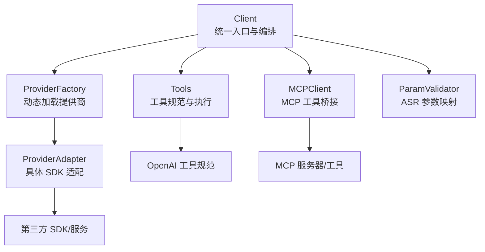
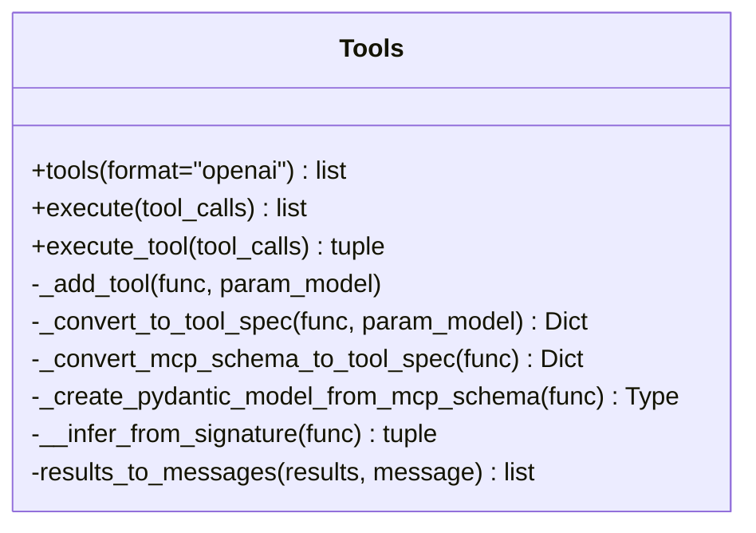
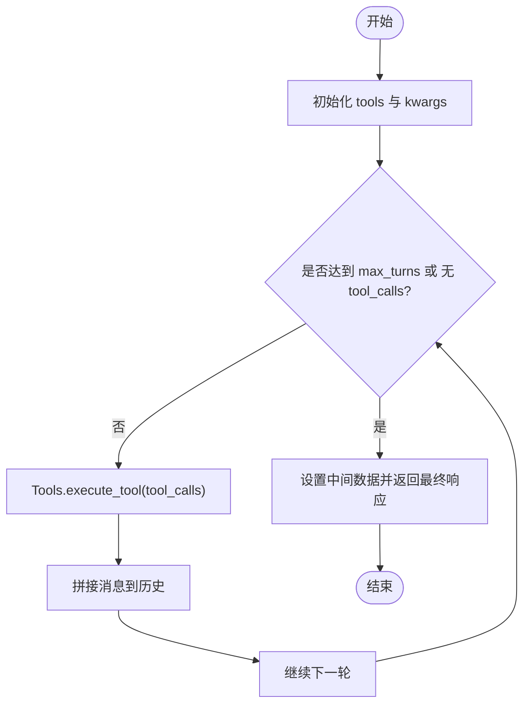
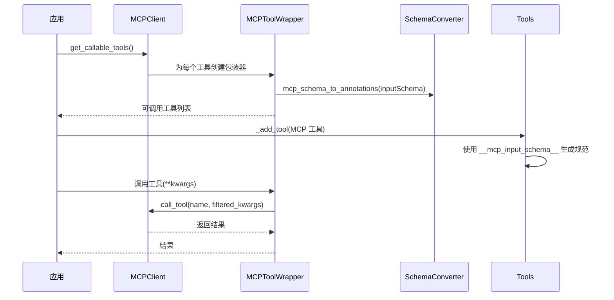
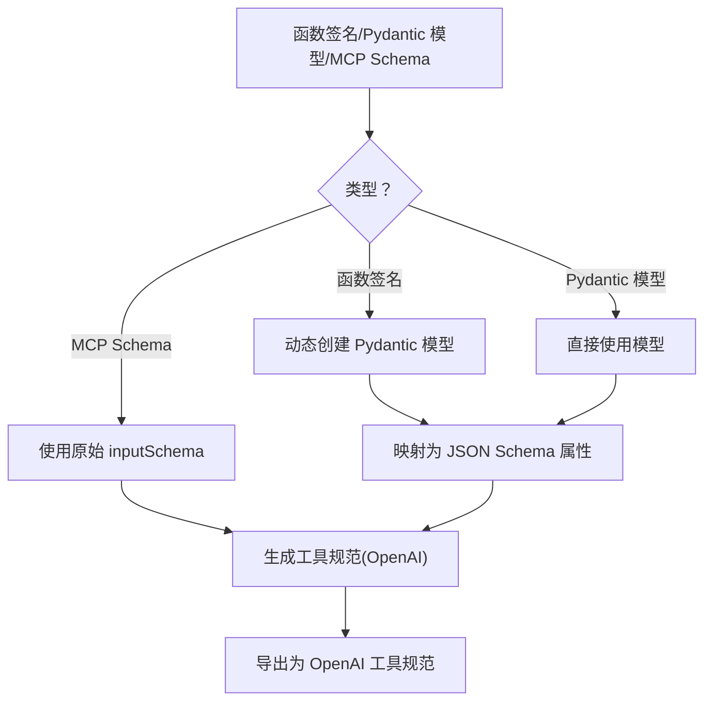

# 智能体的执行：工具、MCP 与 Skills

模型会"想"，但不会"做"。执行层是智能体的手脚：它把模型输出的调用意图翻译成对真实函数、API 与外部系统的操作，再把结果结构化地送回大脑。这一层的能力边界与安全边界，决定了智能体最终能替人做多少事。

原理层面的位置见[智能体的原理](knowledge/llm/agents/agent-principles)。

## 一、工具使用流程

1. 提供工具 (Provide the Tool)：开发者编写好功能函数。
2. 告知模型 (Tell the LLM)：通过系统提示词，明确告诉模型有哪些工具可用，以及如何"请求"调用它们（即输出什么格式的文本）。
3. 解析并执行 (Parse and Execute)：开发者编写代码，监听模型的输出，识别其"请求"，并实际执行对应的函数。
4. 反馈结果 (Feed Back Result)：将函数执行的结果作为新的上下文，送回给模型，让它继续推理或生成最终答案。

这个流程的关键在于，开发者扮演了"翻译官"和"执行者"的角色，弥合了语言模型的"文本生成"能力与现实世界"函数执行"能力之间的鸿沟。


## 二、基本概念

### 1. Tool 定义（真实能力）

每个 tool 本质是一个可执行函数：
- name
- description
- input_schema（JSON Schema）
- handler(args) -> result

这一步可以“手写 schema”，也可以“从函数签名/注解生成 schema”。


### 2. Tool Registry（工具注册表）

负责：
- register(tool)
- get(name)
- list_schemas()：给 LLM 的 tools 列表

还可以加：

- 参数校验（schema validator）
- 类型转换（str -> int 等）
- 安全策略（白名单、超时、重试、限流）


### 3. LLM 接口（模型适配器）

统一调用模型的方法，比如：
- 输入：messages + tools
- 输出：要么是普通文本，要么是 tool_calls=[{name, arguments}]

不同供应商格式不同，写框架时要封装差异 。

#### 1) messages（内部统一格式）

```json
{
    role: "system"|"user"|"assistant"|"tool",
    content: str,
    name?: tool_name
}
```

- tool call 由 assistant 消息携带结构化字段：
- tool_calls: [{id, name, arguments_json_string}]

#### 2) tool result

```json
{
    role:"tool",
    name: tool_name,
    tool_call_id: id,
    content: json.dumps(result)
}
```

### 4. Agent Loop（调度循环）

典型伪流程：
1. 把系统 prompt + 对话历史 + tools schemas 发给 LLM
2. 如果 LLM 返回 tool call：
   - 校验参数
   - 执行 tool
   - 把 tool result 作为新 message 追加回 history
   - 回到第 1 步
3. 如果 LLM 返回最终文本：结束

这才是 agent 的“核心循环”。


## 三、从MCP到Skills
### 1. function calling

从 LLM 视角看，“调用普通函数”分三步：

#### 1) 工具注册
把这些函数包装成 LLM tools JSON 规范，并发送给模型。

- 把某个 Python/TS 函数的名称、作用、参数结构，用 JSON Schema 描述成一个 tool spec
- 对应代码：`Tools.__init__` -> `_add_tools` -> `_convert_to_tool_spec`
- 放到请求里的 llm 的 tools 字段
- 对应代码：`tools=_convert_to_openai_format(tools)`


```json
tools: [
  {
    "type": "function",
    "function": {
      "name": "get_weather",
      "description": "获取某城市天气",
      "parameters": {
        "type": "object",
        "properties": {
          "city": { "type": "string", "description": "城市名" }
        },
        "required": ["city"]
      }
    }
  }
]
```

#### 2) LLM 返回 tool_calls

检查模型返回的 message.tool_calls（`function=Function(arguments='{}', name='get_current_time')`）。

- 要调用哪个函数（name）
- 参数是什么（arguments，是 JSON 字符串）
- 对应代码：`client.toolrunner` 检查 `resp` 中的 `tool_calls`

```python
from openai import OpenAI
import json

client = OpenAI()

resp = client.chat.completions.create(
    model="gpt-4.1-mini",
    messages=[
        {"role": "user", "content": "北京今天天气怎么样？"}
    ],
    tools=tools,
    tool_choice="auto"  # 让模型自行决定
)

# 返回的标准的 OpenAI 风格对象
# ChatCompletion(
#   id='chatcmpl-...',
#   choices=[Choice(..., message=ChatCompletionMessage(..., intermediate_messages=[...]))],    #（列表，通常长度 1）
#   created=...,
#   model='ZhipuAI/GLM-4.7',
#   object='chat.completion',
#   usage=CompletionUsage(...),
#   intermediate_responses=[ChatCompletion(...), ChatCompletion(...)]
# )
```

#### 3) 解析参数并调用工具
在代码里真的去调用这个函数`tool.execute_tool`，把返回结果插入对话消息，再发回模型，多轮循环直到模型不再请求工具或达到 max_turns。

- 把 arguments 反序列化成 dict
- 用它去调用你本地的普通函数
- 然后把执行结果再以 role: "tool" 的消息形式回传给模型，模型基于结果继续对话

OpenAI有`function calling`的标准接口，示例代码如下：

```json
[
  {
    "id": "call_123",
    "type": "function",
    "function": {
      "name": "get_weather",
      "arguments": "{\"city\": \"北京\"}"
    }
  }
]
```

### 2. MCP

**定义**：MCP（Model Context Protocol，模型上下文协议）是由 Entropy 提出的一个标准，旨在为大型语言模型（LLM）提供一种标准化的方式来访问外部工具和数据源。 目的：解决开发者在构建智能体式应用时，需要为每个应用重复编写代码来集成不同工具（如 Slack, GitHub, Google Drive 等）的痛点。 现状：该协议已被许多公司和开发者广泛采用，形成了一个活跃的生态系统。

1. 客户端 (Clients)
  - 角色：希望访问外部工具或数据的应用程序。
  - 示例：Cursor, Claude Desktop, Windsurf。
  - 功能：向 MCP 服务器发送请求，获取数据或执行操作。

2. 服务器 (Servers)
  - 角色：提供工具和数据源的软件服务。
  - 示例：Slack, Google Drive, GitHub, PostgreSQL。
  - 功能：作为“包装器”，接收来自客户端的请求，并将其转换为对原始工具 API 的调用，然后将结果返回给客户端。
  - 来源：部分服务器由服务提供商开发，但也有大量第三方开发者贡献。


### 3. 工具调用总结

| 维度               | Function Calling / Tool Calling                | MCP（Model Context Protocol）              | Skills                                   |
| ------------------ | ---------------------------------------------- | ------------------------------------------ | ---------------------------------------- |
| 抽象层级           | **模型 API 层**                                | **系统 / 协议层**                          | **应用 / 框架层**                        |
| 是否统一标准       | ❌ 各模型厂商定义（OpenAI / Anthropic 等）     | ✅ 开放协议（基于 JSON-RPC 2.0）           | ❌ 无统一标准，框架自定义                |
| 核心目标           | 让 **模型表达“我要调用某个工具”**              | 统一 **工具 / 资源 / 上下文 的接入与发现** | 封装 **可复用的能力单元**                |
| 关注重点           | 工具 schema、tool call、tool result 的消息结构 | 工具暴露、能力协商、跨应用复用             | 组合、状态、编排、复用                   |
| 是否主要是消息格式 | ✅ 是（messages / tools / tool_calls）         | ❌ 否（协议与交互模型为主）                | ❌ 否                                    |
| 是否负责工具发现   | ❌ 不负责                                      | ✅ 负责                                    | 取决于实现                               |
| 是否负责工具执行   | ❌ 不负责（只表达意图）                        | ⚠️ 提供调用接口                            | ✅ 通常包含                              |
| 是否负责调度/循环  | ❌ 否                                          | ❌ 否                                      | ✅ 是                                    |
| 与 LLM 的关系      | **直接对接 LLM API**                           | **不直接对接 LLM**                         | 间接（通过 agent / runtime）             |
| 与 agent 的关系    | agent 的 **底层能力之一**                      | agent 的 **基础设施**                      | agent 的 **高层构件**                    |
| 典型例子           | OpenAI / Claude tools & function call          | Claude MCP server / client                 | LangChain Tools / Semantic Kernel Skills |
| 一句话理解         | 模型怎么说“请帮我用工具”                       | 工具怎么被统一接入与共享                   | agent 能做什么                           |


## 四、AiSuite 框架 tools 模块设计

示例代码使用 [AiSuite](https://github.com/andrewyng/aisuite/) 展示类 OpenAI 风格接口下的工具调用抽象、MCP 集成与模块化扩展。

AISuite 的整体架构围绕“统一客户端 + 工厂 + 抽象层 + 扩展适配器”的模式展开。客户端负责编排流程，框架层提供跨提供商的统一数据结构，工具系统与 MCP 客户端分别解决“工具调用”和“外部工具接入”两大痛点，提供商适配器则承载与具体 SDK 的交互。



### 1. 工具管理与执行
`aisuite/utils/tools.py`：工具注册、参数模型推断/转换、OpenAI 规范导出、工具执行与结果消息构造。

- 工具注册
  - 支持三种注册方式：
    - 显式提供 Pydantic 参数模型；
    - 从函数签名推断参数（需类型注解）；
    - MCP 工具：直接使用其原始 inputSchema，避免类型注解损失。
  - 注册后生成统一工具规范（OpenAI 兼容），并保存参数模型用于后续验证。
- 参数验证与执行
  - execute：仅返回结果列表，适合手动处理消息回传。
  - execute_tool：同时返回结果与“tool”角色的消息，便于自动循环直接拼接到消息历史。
- JSON Schema 生成与转换
  - 将 Pydantic 字段映射为 JSON Schema 属性，支持枚举、默认值、可选性等。
  - 对 MCP 工具，直接采用其 inputSchema，确保复杂类型（数组、嵌套对象、联合类型）不丢失。
- 结果消息构造
  - 将工具执行结果转换为符合 OpenAI 协议的“tool”消息，包含 tool_call_id、名称与内容。




### 2.客户端与自动工具执行循环
`aisuite/client.py`：自动工具执行循环，处理多轮工具调用、消息拼接与中间结果记录。

- 输入参数
  - tools：可为 Tools 实例或可调用工具列表；若为列表则自动封装为 Tools。
  - max_turns：最大工具调用轮次，控制自动循环次数。
- 处理流程
  - 发起一次对话请求；
  - 若响应包含 tool_calls，则调用 Tools.execute_tool 获取结果与消息；
  - 将模型消息与工具结果消息拼接到消息历史；
  - 在未达到 max_turns 且仍有 tool_calls 时继续循环。
- 中间数据
  - intermediate_responses：每轮响应集合；
  - intermediate_messages：包含所有消息（含工具交互）。




### 3. MCP 工具集成
`aisuite/mcp/tool_wrapper.py`、`aisuite/mcp/schema_converter.py`、`aisuite/mcp/config.py`：将 MCP 工具包装为可调用对象，保留原始 JSON Schema 并生成类型注解与签名。

- MCPToolWrapper
  - 将 MCP 工具包装为可调用对象，设置 name、doc、annotations、signature，并保留 mcp_input_schema。
  - 调用时过滤 None 值，通过 MCPClient 执行工具。
- SchemaConverter
  - JSON Schema → Python 类型注解：支持基础类型、数组、联合类型 anyOf/oneOf、空值等。
  - 提取参数描述、构建 docstring，便于工具规范生成。
- MCPConfig
  - 校验与归一化 MCP 配置字典，自动识别 stdio/http 传输，支持 allowed_tools 过滤、use_tool_prefix 命名前缀、超时与响应大小限制等。



### 4. 参数验证与 JSON Schema 生成
`tools.py`：JSON Schema 到 Python 类型注解的转换，支持数组、联合类型等复杂结构。

- 签名推断与参数模型
  - 从函数签名提取参数类型、默认值、可选性与描述，动态创建 Pydantic 模型。
  - 支持枚举类型，将枚举值映射为 JSON Schema 的 enum。
- JSON Schema → OpenAI 规范
  - 将 Pydantic 字段映射为 properties、required、默认值等。
- MCP Schema 保持
  - 对 MCP 工具，直接使用 inputSchema，避免类型注解转换带来的信息损失。



## 五、MCP 连接模式

MCP 采用客户端–服务器架构，四个角色：Host（宿主应用）、Client（协议通信）、Server（工具/数据源包装器）、Transport Layer（JSON-RPC / STDIO / HTTP+SSE）。按智能体的主动性的不同，连接分两种模式：

### 1. Inbound（入站）

智能体作为**接收器**，被动响应外部数据请求，不主动执行任务。

示例：在 Cherry Studio 中查询 Obsidian 笔记——智能体向 Obsidian MCP Server 发送查询请求，Server 返回笔记数据，智能体分析后作答。Obsidian 仅提供静态的数据存储和查询服务。

### 2. Outbound（出站）

智能体**主动采取行动**：写入文件、触发 API、执行代码。

示例："将'完成AI报告'添加到 Obsidian 待办"——智能体通过 MCP 协议发送标准化 JSON 指令，Obsidian 收到指令后修改笔记文件。Obsidian 从被动存储变为可被程序控制的执行端。

## 六、实战：AI 管理知识库

以 Obsidian 为例的完整 MCP 工具链。

### 1. Text Generator 插件

[Obsidian Text Generator](https://docs.text-gen.com/) 将 LLM 集成到笔记系统：自动生成/续写/润色文本、摘要与结构提取、模板化批量输出。支持 OpenAI 兼容接口配置自定义 Endpoint。

默认快捷键 `Ctrl+J`；常用命令：Generate Text!（生成文本）、Templates: Generate & Insert（用模板）、Choose a Model / LLM（切模型）。

模板是其强项——通过模板约束输出格式"压幻觉"。在 `<Vault>/textgenerator/templates/local` 下新建 `.md` 模板：

```text
---
promptId: easymeet
name: "🗞️easymeet"
version: 0.0.1
---

**S (角色设定)**:
你是一位拥有10年经验的敏捷项目管理专家 (Scrum Master)，擅长从混乱的对话中提取可执行的任务项。

**C (背景信息)**:
以下是一段会议录音转录文本。
【原始文本开始】
{{selection}}
【原始文本结束】

**O (任务目标)**:
提取所有明确的任务项：任务内容、负责人、截止时间、状态。

**R (输出要求)**:
1. 输出 Markdown 表格，表头：任务内容 | 负责人 | 截止时间 | 状态 | 优先级。
2. 去除口语化表达；不要输出任何寒暄语。

**E (评估标准)**:
生成表格前自查：是否遗漏了任何一个提到的任务？
```

### 2. Local REST API 插件

为本机开启 HTTP 服务（默认端口 27123），使外部程序可以通过标准 REST 接口读写 Vault：

```python
import requests

url = "http://127.0.0.1:27123/vault/notes/Example.md"
headers = {"Authorization": "Bearer YOUR_API_KEY"}

r = requests.get(url, headers=headers)
print(r.text)
```

能力覆盖：读取笔记（内容/全文搜索/文件列表/frontmatter）与写入修改（新建/覆盖/追加）。

### 3. mcp-obsidian

| 实现 | 语言/分发 | 交互方式 | 特点 |
| --- | --- | --- | --- |
| **mauricio.wolff/mcp-obsidian** | Node / NPM | 直接对 vault 提供安全读写 | 强调避免 frontmatter 损坏 |
| **cyanheads/obsidian-mcp-server** | TS/Node | 通过 Local REST API 插件 | 工具更全、日志/安全/错误处理更服务化 |

```powershell
# 安装并调试（注意路径 \ 要改成 /）
npx "@modelcontextprotocol/inspector" -- npx "@mauricio.wolff/mcp-obsidian@latest" "C:/Users/<you>/Documents/ObsidianVault"
npm install -g "@mauricio.wolff/mcp-obsidian"
```

Cherry Studio 配置示例：

```json
{
  "mcpServers": {
    "obsidian-vault": {
      "command": "npx",
      "args": [
        "-y",
        "@mauricio.wolff/mcp-obsidian@latest",
        "/path/to/MyVault"
      ]
    }
  }
}
```

### 4. server-filesystem

通用文件系统 MCP Server，适合让 Agent 在沙箱目录内操作任意文件：

```powershell
npm i -g "@modelcontextprotocol/server-filesystem"
```

| 命令 | 作用 | 参数格式 |
| --- | --- | --- |
| `list_directory` | 列出目录内容 | `{ "path": "00-inbox" }` |
| `read_file` | 读取文件 | `{ "path": "00-inbox/test.md" }` |
| `write_file` | 创建/覆盖 | `{ "path": "...", "content": "..." }` |
| `append_file` | 追加内容 | `{ "path": "...", "content": "\nnew line" }` |
| `delete_file` | 删除文件 | `{ "path": "..." }` |
| `move_file` | 移动/重命名 | `{ "from": "...", "to": "..." }` |
| `create_directory` | 创建目录 | `{ "path": "new-folder" }` |
| `list_allowed_directories` | 查看沙箱允许路径 | `{}` |

高风险写入操作的安全围栏设计见[提示词工程](knowledge/llm/foundations/prompt-engineering)的综合案例。
