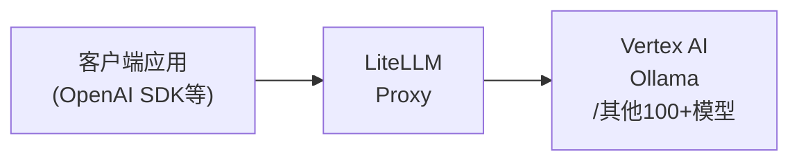

# 本地模型网关

模型网关解决的问题是：让应用与多个模型/供应商解耦。这一篇覆盖三种形态——LiteLLM（自建 API 网关）、供应商切换器（cc-switch）、订阅转 API 聚合（sub2api），以及直连 Vertex AI 与 Ollama 的配置。

## litellm

LiteLLM 是一个开源的 AI 网关（AI Gateway） 和 Python SDK，旨在提供统一的接口来调用 100+ 种不同的大语言模型（LLM）API。它是目前最流行的 LLM 抽象层项目之一，被 Netflix、Lemonade 等企业广泛采用。

### 1. 配置文件

```yaml
model_list:
  - model_name: gpt-5.4
    litellm_params:
      model: vertex_ai/gemini-2.5-pro
      vertex_project: os.environ/GOOGLE_PROJECT_ID
      vertex_location: "global"
      vertex_credentials: os.environ/GOOGLE_APPLICATION_CREDENTIALS

  - model_name: gpt-5.3
    litellm_params:
      model: vertex_ai/gemini-2.5-flash
      vertex_project: os.environ/GOOGLE_PROJECT_ID
      vertex_location: "global"
      vertex_credentials: os.environ/GOOGLE_APPLICATION_CREDENTIALS

general_settings:
  master_key: sk-local-123456

litellm_settings:
  drop_params: true
```

### 2. 项目启动

```powershell
$env:HTTPS_PROXY="http://127.0.0.1:xxxx"
$env:HTTP_PROXY="http://127.0.0.1:xxxx"
$env:AIOHTTP_TRUST_ENV="True"
$env:GOOGLE_APPLICATION_CREDENTIALS="./keys/xxxxxxxxxxxxx.json"

.venv\Scripts\litellm.exe --config ./config.yaml --host 127.0.0.1 --port 4200
```

### 3. LLM调用



#### 1) python

```python
import openai

# 指向 LiteLLM Proxy
client = openai.OpenAI(api_key="sk-local-123456", base_url="http://localhost:4200")

# 使用方式与原生 OpenAI 完全一致
response = client.chat.completions.create(model="gpt-5.4", messages=["Vertex AI 有什么优势？"])
```

#### 2) powershell

```powershell
$headers = @{
   "Authorization" = "Bearer sk-local-123456"
}

Invoke-RestMethod -Uri "http://localhost:11434/v1/models" -Method Get -Headers $headers |
    Select-Object -ExpandProperty data |
    Format-Table -AutoSize

$headers = @{
    "Content-Type"  = "application/json"
    "Authorization" = "Bearer sk-local-123456"
}

$body = '{
    "model": "kimi2.5-remote",
    "messages": [
        {
            "role": "user",
            "content": "Vertex AI 有什么优势？"
        }
    ]
}'

Invoke-RestMethod -Uri "http://localhost:8000/v1/chat/completions" -Method Post -Headers $headers -Body $body
```

## 供应商切换：cc-switch

[cc-switch](https://github.com/farion1231/cc-switch) 是跨平台桌面应用，用一个界面统一管理八个 AI CLI 工具的供应商配置：Claude Code、Claude Desktop、Codex、Gemini CLI、Grok Build、OpenCode、OpenClaw 与 Hermes。这些工具各有自己的配置格式（JSON/TOML/.env），手工切换供应商意味着反复编辑配置文件——cc-switch 把这件事产品化了。

核心能力：

- **50+ 供应商预设**，一键导入与切换；支持统一供应商配置跨 Claude Code / Codex / Gemini 共享；
- **热切换**：通过本地代理转发请求，Claude Code 切换供应商无需重启终端；Codex/Gemini 等静态缓存配置的工具需要重启；
- **统一的 MCP 与 Skills 管理**：一个面板管理所有工具的 MCP 服务器和技能，双向同步；
- 系统托盘快速切换、SQLite 原子写入防配置损坏、云同步（Dropbox/OneDrive/WebDAV）。

典型用法：添加供应商（选预设或填 OpenAI 兼容端点）→ 点"启用" → 对应 CLI 按各自规则生效。它的价值在于把"多工具 × 多供应商 × 多密钥"的管理成本从手工编辑降到点击一次。

## 订阅转 API：sub2api

[sub2api](https://github.com/Wei-Shaw/sub2api) 是开源的订阅转 API 网关：把 Claude、OpenAI（Codex）、Gemini、Grok 的**网页版订阅账号**封装为标准 API 接口对外提供。

工作方式：

- **账号聚合**：同时接入多个平台的订阅账号（OAuth/API Key），集中管理认证、额度与计费；
- **协议转换**：上游非标接口经转换层封装为 Anthropic Messages 或 OpenAI 兼容格式（Responses / Chat Completions），下游应用零改造接入；
- **密钥分发**：批量生成独立 API Key，可设置权限范围、有效期与额度，适合团队/拼车场景分摊订阅成本；
- 负载均衡与故障转移，多账号轮询规避单账号限流。

## Vertex AI

### 1. Gemini API

`Vertex AI`是 `Google Cloud` 里的一个托管 AI 服务。典型流程是：

1. 在 Google Cloud 里选择或创建项目，
2. 启用 Vertex AI API，按 Google Cloud 的身份认证方式访问，相关权限由 Google Cloud IAM 控制。

`Gemini API`是调用 Gemini 模型的接口，主要有两条使用路径：

1. `Google AI Studio`：常用 API key 访问，
2. `Google Cloud`：
   - `Google Cloud API key`(开发)
   - `service account key`（不推荐）
   - `Application Default Credentials`（生产）

### 2. LLM调用

```python
# pip install google-cloud-aiplatform
from google.cloud import aiplatform
from google.oauth2 import service_account
from vertexai.generative_models import GenerativeModel
from dotenv import load_dotenv
import os

load_dotenv()

KEY_PATH = os.environ.get('GOOGLE_APPLICATION_CREDENTIALS')
credentials = service_account.Credentials.from_service_account_file(KEY_PATH)

PROJECT_ID = os.environ.get("GOOGLE_PROJECT_ID")
LOCATION = "global"

def main():
    print("Hello from test!")
    aiplatform.init(project=PROJECT_ID, location=LOCATION, credentials=credentials)
    model = GenerativeModel("gemini-2.5-flash")
    response = model.generate_content("Vertex AI 有什么优势？")
    print(response.text)

if __name__ == "__main__":
    main()
```

## Ollama

### 1. BaseURL

- OpenAI 兼容客户端：`base_url = http://127.0.0.1:11434/v1`
- 原生 Ollama API 客户端：`base_url = http://127.0.0.1:11434`
  - `POST /api/generate`
  - `POST /api/chat`
  - `GET /api/tags`

### 2. 查看模型

```powershell
$env:OLLAMA_HOST=0.0.0.0:11434

Invoke-RestMethod -Uri "http://localhost:11434/v1/models" -Method Get |
    Select-Object -ExpandProperty data |
    Format-Table -AutoSize

Invoke-RestMethod -Uri "http://localhost:11434/api/tags" -Method Get |
    Select-Object -ExpandProperty models |
    Format-Table -AutoSize
```

### 3. 调用模型

#### 1) HTTP调用
```powershell
$body = @{
    model = "kimi-k2.5:cloud"
    prompt = "请只回复：测试成功"
    stream = $false
} | ConvertTo-Json -Depth 5

$r = Invoke-RestMethod `
  -Uri "http://127.0.0.1:11434/api/generate" `
  -Method Post `
  -ContentType "application/json; charset=utf-8" `
  -Body $body

$r.response
```

#### 2) OpenAI兼容
```python
import openai

def chat():
    client = openai.OpenAI(
        base_url="http://127.0.0.1:11434/v1/",
        api_key="none"
    )

    response = client.chat.completions.create(
        model="kimi-k2.5:cloud",
        messages=[{"role": "user", "content": "Vertex AI 有什么优势？"}]
    )

    print(response.choices[0].message.content)

if __name__=="__main__":
    chat()
```