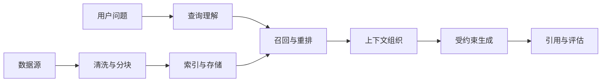

# RAG 技术

RAG（Retrieval-Augmented Generation）通过外部证据约束模型回答，解决知识时效、私有数据和可追溯性问题。本篇按链路顺序覆盖完整技术栈：总体模型 → 加载与分块 → 索引与召回 → 查询优化。

## 一、总体模型



### 摄取

把文档、数据库记录、网页或多媒体转换为可检索单元。核心问题是来源、权限、版本、结构和更新策略。

### 检索

根据问题召回候选证据，再通过重排、过滤和压缩控制上下文。向量检索、关键词检索、图检索和结构化查询可以组合使用。

### 生成

把证据组织为模型能够使用的上下文，并明确引用、拒答和边界规则。生成阶段不能弥补错误的权限、缺失的数据或糟糕的召回。

### 评估

至少拆开评估：数据与索引是否及时、完整；目标证据是否被召回；排序是否把关键证据放在前面；回答是否忠于证据；系统在无证据时是否拒答。

### 什么时候不需要 RAG

- 问题可以直接由数据库或搜索接口回答；
- 数据规模很小，可以完整放入上下文；
- 任务主要依赖推理或计算，而不是外部知识；
- 权限和数据治理尚未解决。

最小实现样例见 [`examples/overview/`](knowledge/llm/rag/examples/overview/)。

## 二、加载与分块

### 1. 数据加载

`unstructured` 是底层解析库，`langchain_community.document_loaders` 是其 LangChain 生态封装。它把原始文档解析成"有语义类型的元素列表"，并保留元数据。

**partition 关键参数**：

| 参数 | 作用 |
| --- | --- |
| `strategy` | `fast`(文本) / `hi_res`(扫描，需 Tesseract OCR) / `ocr_only`（精度 vs 速度） |
| `infer_table_structure` | 是否解析表格 |
| `languages` | 指定语言 `['chi_sim', 'chi_tra', 'eng']` |
| `include_page_breaks` | 是否保留分页 |

**元素类型**：Title（标题）、NarrativeText（正文叙述）、ListItem、Table、Image、Formula、FigureCaption、Header/Footer/PageNumber、CodeSnippet、EmailAddress、Address 等——每个元素带语义标签，这一步本身就完成了对文档的结构化理解。

### 2. 数据清洗

清掉页眉页脚、页码、目录噪音，尽量保留"章/节/条/附件"结构。后面的切块和检索质量都取决于这里的文本质量。

### 3. 文本分块

LLM 的上下文长度有限：一本标准规范几十万到上百万 token，不切分无法送入模型；而整篇文档的 embedding 会变成语义平均值，很难检索到正确内容。

**分区 (Partitioning)** 将原始文档解析成带语义标签的元素；**分块 (Chunking)** 则以元素列表为输入进行智能组合，产出 LLM 友好的文本块——向量检索和模型处理的基本单位。

#### 切分器速查

LangChain：

| 切分函数 | 类型 | 原理 | 适用场景 | 特点 |
| --- | --- | --- | --- | --- |
| `RecursiveCharacterTextSplitter` | 递归字符切分 | 按分隔符优先级递归切分直到满足 chunk_size | 通用文本（默认推荐） | 可控性强，适合中文，支持 overlap |
| `CharacterTextSplitter` | 固定字符切分 | 按固定字符数硬切分 | 简单场景 | 不考虑语义边界 |
| `TokenTextSplitter` | Token 级切分 | 按 token 数切分 | 对 token 成本敏感场景 | 贴近 LLM 上下文限制 |
| `SentenceTransformersTokenTextSplitter` | 句子+Token 切分 | 先按句子再按 token 限制 | 语义完整性要求高 | 比纯字符更语义友好 |
| `MarkdownHeaderTextSplitter` | Markdown 结构切分 | 按标题层级切分 | 技术文档、教程 | 强结构保留 |
| `PythonCodeTextSplitter` | 代码结构切分 | 按 Python 语法结构切分 | 代码库 | 保持函数/类完整 |
| `RecursiveJsonSplitter` | JSON 结构切分 | 按 JSON 层级切分 | JSON 数据 | 保持字段语义 |
| `HTMLHeaderTextSplitter` | HTML 结构切分 | 按 HTML 标签层级切分 | 网页数据 | 保持 DOM 结构 |

LlamaIndex：

| 切分组件 | 类型 | 特点 |
| --- | --- | --- |
| `SentenceSplitter` | 句子级切分 | 默认推荐，语义完整性较好 |
| `TokenTextSplitter` | Token 级切分 | 精确控制 token |
| `SentenceWindowNodeParser` | 句子窗口 | 以句子为中心扩展窗口，QA 场景保留局部语境 |
| `MarkdownNodeParser` | Markdown 结构 | 技术文档保留层级 |
| `HierarchicalNodeParser` | 层级切分 | 多层节点（粗→细），支持多粒度索引 |
| `CodeSplitter` | 代码切分 | 按函数/类结构 |

在线调试工具：[ChunkViz](https://www.chunkviz.com/)。

#### 四种切分范式

**固定长度**：Fixed-size chunking 与 Sliding Window（带重叠）：

```python
from langchain_text_splitters import CharacterTextSplitter

text_splitter = CharacterTextSplitter(
    chunk_size=100,    # 每块目标大小不超过100字符
    chunk_overlap=10   # 相邻块重叠10字符，缓解语义割裂
)
```

**基于语义结构**：Paragraph-based / Sentence-based chunking，按段落或句子边界切。

**语义感知型**：Semantic Chunking 通过 `percentile`、`standard_deviation`、`interquartile`、`gradient` 计算句间语义距离，在语义突变处断开：

```python
# pip install langchain-experimental
from langchain_community.embeddings import HuggingFaceEmbeddings
from langchain_experimental.text_splitter import SemanticChunker

embeddings = HuggingFaceEmbeddings(
    model_name="BAAI/bge-small-zh-v1.5",
    model_kwargs={'device': 'cpu'},
    encode_kwargs={'normalize_embeddings': True}
)

text_splitter = SemanticChunker(embeddings, breakpoint_threshold_type="percentile")
docs = text_splitter.split_documents(documents)
```

递归切分（最常用）：

```python
from langchain.text_splitter import RecursiveCharacterTextSplitter

text_splitter = RecursiveCharacterTextSplitter(
    separators=["\n\n", "\n", "。", "，", " ", ""],  # 分隔符优先级
    chunk_size=200,
    chunk_overlap=10,
)

# 代码文档优化分隔符
splitter = RecursiveCharacterTextSplitter.from_language(
    language=Language.PYTHON, chunk_size=500, chunk_overlap=50
)
```

**任务驱动型**：Query-aware Chunking（面向预期查询组织块）、Graph-based Chunking（以图谱结构组织）。

### 4. 主流文档加载器

场景推荐速查：

| 场景 | 推荐 |
| --- | --- |
| 快速 RAG 原型 | **Unstructured** + DirectoryLoader |
| 学术 / 技术 PDF | PyMuPDF4LLM / Marker |
| 高精度合同 / 论文 | LlamaParse |
| 企业级合规 | Docling |
| 网页内容 | FireCrawlLoader |
| 财报 / 复杂版式 | MinerU |

各工具定位一览：

| 工具 | 定位 | 优势 | 局限 | 适用 |
| --- | --- | --- | --- | --- |
| **PyMuPDF4LLM** | PDF→Markdown 结构化解析 | 开源免费、GPU 加速、对论文/手册友好 | 复杂版式有损失；只服务 PDF | 学术论文入库、技术文档→知识库 |
| **TextLoader** | 最基础文本加载器 | 极简稳定、无依赖 | 不解析结构 | 代码库、日志、已结构化文本 |
| **DirectoryLoader** | 批量文档入口 | 遍历目录按类型分发 Loader | 本身不理解文档 | 统一文档管道、批量入库 |
| **Unstructured** | 通用文档解析中间层 | 覆盖 PDF/Word/HTML/PPT/Email，生态成熟 | 免费版精度一般、性能一般 | "什么文档都有"的企业、RAG MVP |
| **FireCrawlLoader** | 网页→干净文本 | 实时抓取、自动去广告导航、LLM 友好 | 依赖网络、JS-heavy 受限 | 新闻监控、在线文档问答 |
| **LlamaParse** | 高精度 PDF 解析（商业） | 版式/表格/引用理解极准 | 收费、依赖云 | 法律合同、学术论文 |
| **Docling** | 企业级文档理解（IBM） | 可审计可控、合规友好 | 上手成本高 | 金融/能源等合规场景 |
| **Marker** | 极致 PDF→Markdown | GPU 加速、高保真还原 | 只做 PDF | 学术文献库、技术书籍 |
| **MinerU** | 多模态文档理解 | LayoutLMv3+YOLOv8，财报扫描件强 | 部署算力成本高 | 财务报表、复杂版式智能化 |

## 三、索引与召回

### 1. 向量嵌入

**核心原则**：在 Embedding 构建的向量空间中，语义相似的对象距离更近，不相关的距离更远。

**关键度量**：

- 余弦相似度 (Cosine Similarity)：两向量夹角的余弦值，越接近 1 语义越相似，最常用；
- 点积 (Dot Product)：归一化后等价于余弦相似度；
- 欧氏距离 (Euclidean Distance)：空间直线距离，越小越相似。

MTEB（Massive Text Embedding Benchmark）覆盖多种嵌入任务的评测基准，可用于比较模型在检索、聚类、分类上的表现。

**嵌入模型对比**：

| 技术 | 模态类型 | 当前地位 | 核心特点 | 典型应用场景 | 研发团队 |
| --- | --- | --- | --- | --- | --- |
| word2vec | 单模态（文本） | 理论基础 > 实用价值 | 词级静态 embedding | 相似词分析、早期 NLP | Google |
| bge-m3 | 单模态（文本） | 主流开源文本 embedding | 支持 query/doc；长文本强 | 文本 RAG、企业知识库 | BAAI |
| bge-visualized-m3 | 多模态（图文） | 开源多模态代表 | 双编码器；图文对齐 | 图文检索、多模态 RAG | BAAI |
| OpenAI Embedding | 单模态（文本） | 商业常用 | 高质量闭源；API 易用 | SaaS RAG | OpenAI |
| E5 | 单模态（文本） | 开源检索主流 | 指令式；区分 query/doc | 英文检索、RAG | Microsoft |
| Gemini Embedding | 单模态（文本） | Google 生态常用 | task_type 支持好 | Google Cloud RAG | Google |
| CLIP | 多模态（图文） | 多模态奠基模型 | 双编码器；对比学习；zero-shot | 图文检索 | OpenAI |
| Cohere embed | 单模态（文本） | 商业常用 | 多语言混合检索强；配套 Rerank | 检索+重排一站式 | Cohere |

**文本嵌入**：`BAAI/bge-base-en-v1.5` 是智源 BGE 系列英文基础版（768 维稠密向量），中文对应 `bge-base-zh-v1.5`。

[text_embedding.py](./examples/indexing/text_embedding.py ":include :type=code python")

**图像嵌入**：EVA-CLIP 是对原始 CLIP 的重大改进，将图像和文本映射到同一共享 768 维向量空间，图像编码器可单独当图像嵌入模型用。

[image_embedding.py](./examples/indexing/image_embedding.py ":include :type=code python")

**多模态嵌入**：Visualized-BGE 是 BAAI 出品的 CLIP 开源平替。CLIP 的核心思想是双塔模型——让文本和图像在同一向量空间可比；Visualized-BGE 则是"单塔 + token 融合"结构，服务于 RAG 检索而非 zero-shot 分类：

```text
image -> vision backbone -> patch tokens
text  -> tokenizer -> tokens
                ⬇
[BGE CLS] + [image tokens] + [text tokens]
                ⬇
        shared BGE encoder
                ⬇
        unified embedding
```

构成对照：

| 项目 | BGE | EVA-CLIP |
| --- | --- | --- |
| 输入 | token ids | 图像像素 |
| 前处理 | embedding lookup | patch embedding |
| 主干 | Transformer encoder | Transformer encoder |
| 输出 | [B,T,768] | [B,1+N,768] |
| CLS 含义 | 全局文本语义 | 全局视觉语义 |

融合机制：图像 patch tokens 经投影层对齐到 BGE 维度，丢弃视觉 CLS 后与文本 tokens 拼接成单一序列 `[BGE_CLS][IMG tokens][TXT tokens]`，送入同一个 BGE encoder，最后取 CLS 归一化输出。

### 2. 向量数据库

**架构四层**：存储层（向量与元数据、分布式）、索引层（HNSW/LSH/PQ 等）、查询层（混合查询与优化）、服务层（连接管理、监控、安全）。

**主流数据库对比**：

| 数据库 | 类型 | 核心特点 | 最佳适用场景 | Python 接口 |
| :--- | :--- | :--- | :--- | :--- |
| Chroma | 开源/本地 | 最轻量，纯 Python，开箱即用 | 快速原型、学习开发 | `chromadb` |
| FAISS | 开源/本地 | Meta 出品，GPU 加速，纯向量无元数据 | 海量检索、科研实验 | `faiss-cpu/gpu` |
| Milvus | 开源/本地+云 | 十亿级规模，分布式 | 大规模生产、企业级 RAG | `pymilvus` |
| Milvus Lite | 开源/本地 | 本地文件存储，无依赖 | 本地开发测试 | `milvus` |
| Weaviate | 开源/本地+云 | GraphQL，自带向量化模块 | 灵活查询、多租户 SaaS | `weaviate-client` |
| Pinecone | 云服务 | 完全托管零运维 | 快速上线、无运维团队 | `pinecone-client` |
| Qdrant | 开源/本地+云 | Rust 高性能，过滤+混合搜索 | 生产级本地部署、边缘计算 | `qdrant-client` |
| pgvector | 开源/本地+云 | Postgres 插件，关系型+向量统一 | 已有 PG 生态、SQL+向量联合查询 | `psycopg2` + SQL |
| Elasticsearch | 开源/本地+云 | 传统搜索+向量混合，全文检索强 | 已有 ES 集群、混合搜索 | `elasticsearch` |
| Zilliz Cloud | 云服务 | Milvus 全托管版 | 大规模生产、多云策略 | `pymilvus` |

**向量索引算法**：

| 类别 | 核心思想 | 代表算法 | 是否近似 | 典型应用场景 |
| --- | --- | --- | --- | --- |
| 暴力搜索 | 全量距离计算 | FLAT | 否 | 小规模精确检索、评测基线 |
| 树结构 | 空间递归划分 | Annoy / KD-tree | 是 | 中低维、静态向量集合 |
| 哈希方法 | 相似向量映射同桶 | LSH | 是 | 粗召回、去重（现多为辅助手段） |
| 聚类倒排 | 先聚类再局部搜索 | IVF | 是 | 大规模通用召回 |
| 图结构 | 可导航邻接图 | HNSW / NSG | 是 | 在线低延迟检索、RAG 问答 |
| 量化压缩 | 向量编码压缩 | PQ / OPQ | 是 | 内存受限的大规模库 |
| 磁盘图结构 | 图索引外存优化 | DiskANN | 是 | 百亿级、冷数据语义搜索 |

FAISS 示例——注意它的定位是**数学工具包而非数据库**：轻量、免费、支持 GPU，但只在内存或磁盘文件中，没有增删改查能力，删除向量通常需重建索引。

[faiss_demo.py](./examples/indexing/faiss_demo.py ":include :type=code python")

Milvus 示例——基础 ANN Search 之外还支持过滤检索、范围检索、多向量混合检索与分组检索。

[milvus_demo.py](./examples/indexing/milvus_demo.py ":include :type=code python")

Qdrant 本地部署（Rust 编写，API 友好，支持"向量相似度 + 条件过滤"组合查询）：

```bash
docker pull qdrant/qdrant

docker run -d `
  --name qdrant `
  -p 6333:6333 `
  -p 6334:6334 `
  -v qdrant_storage:/qdrant/storage `
  qdrant/qdrant
# http://localhost:6333/dashboard 为管理界面

pip install qdrant-client
```

### 3. 索引优化

索引优化的本质是在**查询延迟（Latency）、召回率（Recall）、资源消耗（内存/CPU/IO）**之间平衡。

**ANN 索引优化全景**：

| 层级 | 优化目标 | 关键机制 | 典型手段 |
| --- | --- | --- | --- |
| 存储层 | 降本、IO 友好 | 数据分布与分片 | Hash/Range 分区；Shard key 设计；冷热分层 |
| | | 存储格式与布局 | 列式/行式选择；向量与元数据分离；mmap |
| | | 压缩与编码 | PQ/SQ 码存储；字典编码 |
| | | 缓存体系 | 热向量缓存；block/page cache；预取 |
| | | 一致性与副本 | 副本数调优；主从读；一致性级别 |
| 索引层 | 召回-延迟-资源平衡 | 索引类型选型 | FLAT / IVF_FLAT / IVF_PQ / HNSW / DiskANN 组合 |
| | | 索引参数调优 | IVF：`nlist/nprobe`；HNSW：`M/ef/efConstruction` |
| | | 索引构建优化 | 批量构建；并行；GPU 构建；训练集采样 |
| | | 增量与重建 | Segment 级索引；定期 retrain；双索引切换 |
| 查询层 | 降延迟提质量 | 搜索空间裁剪 | TopK 限制；early termination |
| | | 多阶段检索 | ANN 粗召回 → cross-encoder 精排 |
| | | 混合检索与融合 | BM25 + Vector；RRF 加权融合 |
| | | 过滤与执行计划 | Filter pushdown；先过滤后向量 |
| 服务层 | 稳定安全可观测 | 流控与弹性 | 限流熔断降级；SLA 分级 |
| | | 监控与诊断 | QPS/P99/Recall；慢查询分析 |
| | | 安全治理 | 认证鉴权；审计日志；RBAC/ABAC |

**句子窗口元数据**：文档拆为单句节点并附窗口元数据（前后 N 句）；检索在句子级别做相似度（更精确）；生成阶段自动用元数据扩展回上下文窗口。

**分层构建索引**：建"摘要指针层"（IndexNode + 顶层 VectorStoreIndex）+ "子引擎层"（每个数据源一个引擎，如 PandasQueryEngine/SQL/子向量库）+ id 映射。检索先在摘要层路由（top-k 很小），再进入命中的子引擎执行，兼顾全局理解与精确执行。

```text
用户Query
  ↓
[顶层向量索引：摘要IndexNode] ——（语义相似度路由）→ 命中某个index_id
  ↓
[RecursiveRetriever] ——（用index_id做映射）→ 选中子QueryEngine
  ↓
[子QueryEngine执行] → 结果
```

## 四、查询优化

用户的原始问题往往不是最优检索输入——可能过于复杂、含歧义或与文档措辞存在偏差。查询优化在检索之前对问题做"预处理"。

### 1. Query Transformation

**混合检索（Hybrid Search）**：结合稀疏向量与密集向量。

- 稀疏向量：基于词频统计（BM25 是成功代表），维度极高但绝大多数为零；
- 密集向量：深度学习的低维稠密表示；
- OOV 未登录词：稀疏方法会完全忽略，密集方法通过子词分割（BPE/WordPiece）更好处理。

融合方法：倒数排序融合（RRF，不关心原始得分只看排名）与加权线性组合（得分归一化后按权重 α 组合）。

**重排序**：

| 特性 | RRF | RankLLM | Cross-Encoder | ColBERT |
| --- | --- | --- | --- | --- |
| 核心机制 | 融合多个排序 | LLM 推理生成排序列表 | 联合编码计算相关分 | 独立编码后期交互 |
| 计算成本 | 低 | 中（API 费用延迟） | 高（N 次推理） | 中（点积） |
| 交互粒度 | 仅排名 | 概念/语义级 | Query-Doc Pair 句子级 | Token 级 |
| 适用场景 | 多路召回融合 | 高价值语义理解 | Top-K 精排 | Top-K 重排 |

**压缩**：内容提取（只抽与查询相关的句子段落）与文档过滤（丢弃精细判断后不相关的整文档）。

**校正**：引入自我反思循环——生成前先评估检索文档质量，检索失败时主动寻求外部帮助，减少幻觉。

### 2. Query Construction

利用 LLM 把自然语言翻译成结构化查询：

- **文本到元数据**：自查询检索器把自然语言分解为"语义查询字符串 + 元数据过滤器"，同时做语义搜索与精确过滤。流程：定义元数据结构 → 查询解析（LLM 分解）→ 执行组合查询。
- **文本到 Cypher**：自然语言直接翻译成 Neo4j 图查询语句。
- **Text2SQL 优化策略**：提供精确数据库模式（CREATE TABLE 语句是地图）；提供高质量"问题-SQL"示例对；用 RAG 增强上下文（建专门的"知识库"存放表字段描述、业务术语同义词、复杂 JOIN 示例，提问时先检索再生成 SQL）——极大降低幻觉风险。

### 3. Query Route

**查询翻译**——弥合自然语言提问与文档库之间的语义鸿沟：

- 提示工程：要求 LLM 分析意图并输出结构化指令；
- 多查询分解 (Multi-query)：复杂问题拆成多个简单子问题分别检索，结果合并去重；
- 退步提示 (Step-Back Prompting)：先生成更高层次的"退步问题"（探寻通用原理），以其答案作为上下文再回答原问题；
- HyDE：让 LLM 生成"假设性答案文档"，用它向量化后去检索真实文档。

**查询路由**：

- 数据源路由：按意图路由到不同知识库；
- 组件路由：按复杂度分配给不同处理组件平衡成本效果；
- 提示模板路由：按任务类型动态选提示词模板。
